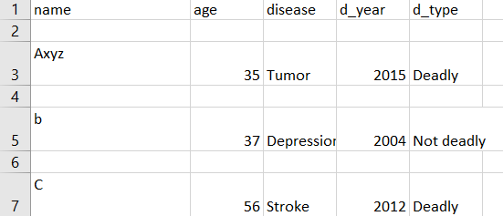
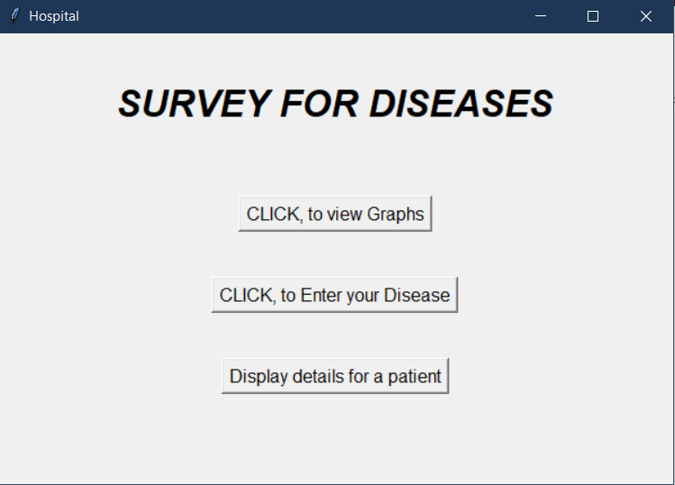
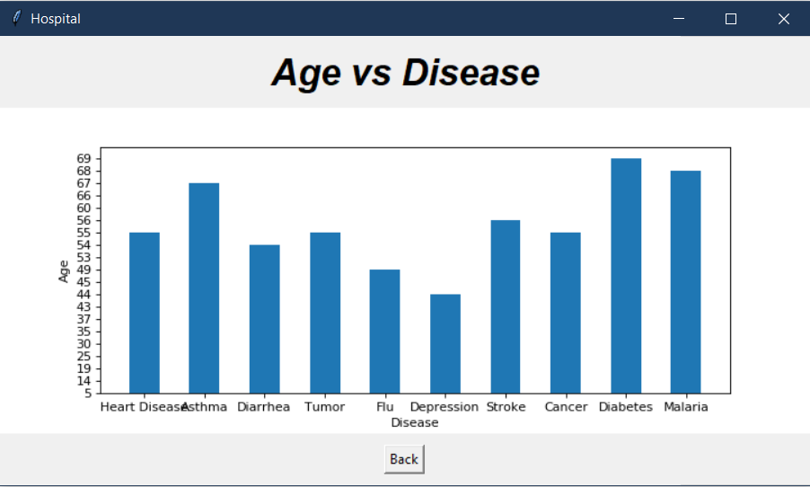
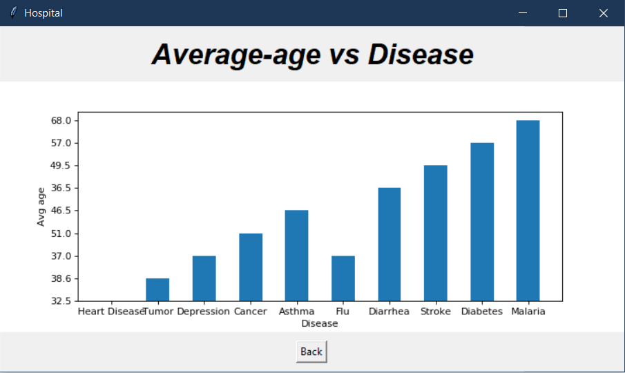
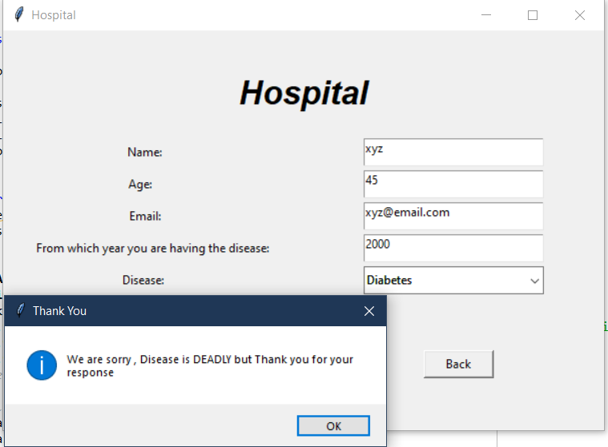
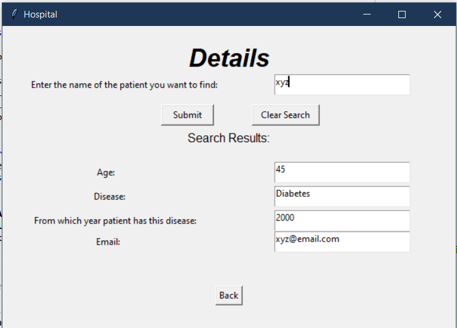

# disease_survey
Disease survey python based software which takes disease related information as input and predicts whether the disease is dangerous or not and also displays some graphs related to the data.

Snapshot of the dataset used - 

Some screenshots of the project displaying the functionality are as follows - 

